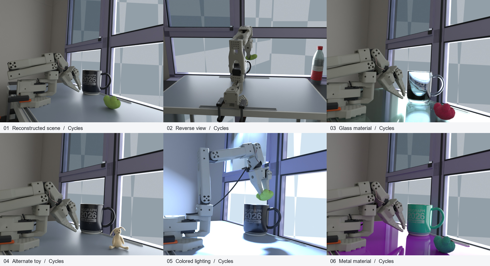
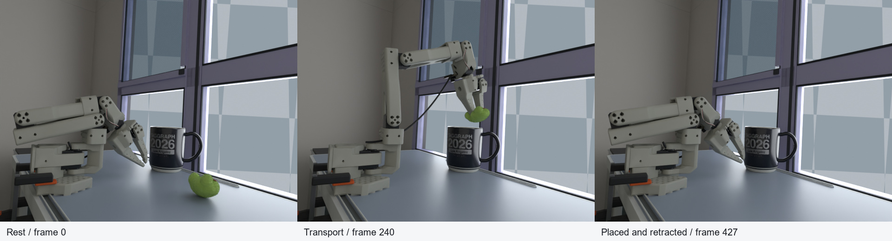
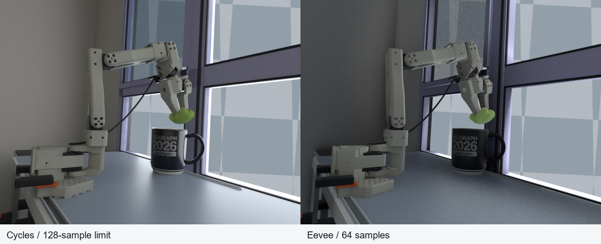

# MiracleAug

**One demonstration. Diverse conditions. Task-consistent augmentation.**

English · [简体中文](README.zh-CN.md)

MiracleAug is an agent skill for turning a single robot demonstration into an editable
Blender reconstruction and augmented demonstrations with synchronized robot trajectories.
It is designed for GPT-6 Astra or a model with equivalent or stronger visual, spatial
and coding capabilities.

Start with a video, a local robot dataset, or a Hugging Face dataset and episode index.
Multiview video, images and text references are optional. The agent first saves a
reviewable scene checkpoint, then generates the requested number of task-valid samples,
validates the native dataset, and prepares or performs the authorized upload.

## Results from the reconstructed scene



Actual Blender renders from the completed tabletop reconstruction: the calibrated
scene, a reverse camera, glass and metal materials, an alternate toy, and colored
lighting. Each tile is rendered with Cycles at 640 × 480, with a 128-sample limit.
No original camera frames or generated illustrations are used in this gallery.

The exterior is replaced with an opaque synthetic mosaic **at this scene owner's
request**. MiracleAug preserves scene appearance by default; redaction is applied
only when the user explicitly requests it. The same request covers reflections,
transmission and packed source images.



The same calibrated demonstration at frames 0, 240 and 427: rest, transport and the
object remaining inside the cup after retraction. These are selected frames from
full-length trajectory validation, not a claim that the long dataset batch has finished.



Matched camera and task time: Cycles with a 128-sample limit and Eevee with 64 samples.
Both use the same reconstructed scene and trajectory. Engine settings and quality
labels accompany the data; training weights are configurable and default to one.

See [showcase provenance and attribution](assets/showcase/README.md) for render settings,
privacy scope and asset sources. These images demonstrate scene results. The separate
64-Cycles / 1,216-Eevee production batch was still running when this gallery was prepared;
complete dataset upload and improved policy generalization are not claimed here.

## What the skill carries through

- Metric, separated geometry; CAD/URDF robot kinematics; calibrated cameras and motion;
  source-view overlays and checks from new viewpoints.
- Weak and strong camera, lighting, material, environment, object and trajectory
  variations, with replanning when a change affects task contact or reachability.
- Exact accepted quotas, seeded candidates, same-category replacements, immutable
  checkpoints and resumable server execution.
- Native dataset validation, joint trajectories, action semantics, camera/object
  transforms, renderer labels, source lineage and explicit limitations.

Unobserved surfaces remain labelled as inferred. When input contains video but no
joint/control data, estimated motion is identified as inferred or synthesized;
it is never presented as recorded action ground truth. Dataset validity and policy
generalization are evaluated separately.

## Use MiracleAug

Place this directory at `~/.codex/skills/miracleaug` or in your agent's compatible
skill directory. The entry point is [SKILL.md](SKILL.md). The skill works with your own
inputs and does not require the private source dataset or scene used in the gallery.

```bash
git clone https://github.com/rubatotree/miracle-aug-skill.git ~/.codex/skills/miracleaug
```

Example request:

> Use $miracleaug to reconstruct episode 3 of the Hugging Face dataset owner/demo.
> Use this orbit video as an optional geometry reference. Save a Blender scene
> checkpoint, then generate 100 accepted demonstrations on my Ubuntu GPU server:
> 20 Cycles and 80 Eevee. Emphasize strong lighting, material and camera variations.
> Export LeRobot data and joint trajectories, then upload to my specified private repo.

A single `demo.mp4`, with or without extra references, is also a valid starting point.
You can request reconstruction only. To redact a scene, add an explicit instruction
such as “pixelate the exterior before rendering or sharing.” Otherwise no redaction
is performed. The agent inspects available metadata before asking for missing inputs.

## Citation

If you use MiracleAug in your research, please cite the version you used. The fixed
release below is **v0.1.3**, published on September 10, 2026:

> Zhu, Y. (2026). *MiracleAug* (Version 0.1.3) [Computer software]. GitHub.
> https://github.com/rubatotree/miracle-aug-skill/tree/v0.1.3

```bibtex
@software{zhu2026miracleaug,
  author  = {Zhu, Yutian},
  title   = {{MiracleAug}},
  year    = {2026},
  date    = {2026-09-10},
  version = {0.1.3},
  url     = {https://github.com/rubatotree/miracle-aug-skill/tree/v0.1.3}
}
```

Download [CITATION.bib](CITATION.bib), or use GitHub's **Cite this repository** entry
generated from [CITATION.cff](CITATION.cff). To reproduce this release, check out the
`v0.1.3` tag. Its identifier is the versioned GitHub URL; no DOI has been assigned.

## Tools and verification

The package includes a selected-episode reader, a finite quota/evidence ledger, a
frame-contract validator, platform-specific headless EGL support, and synthetic tests.
The agent implements the actual robot/task adapter; this is not a pretrained universal
inverse-rendering or action-recovery model.

Core helpers use Python 3.10+ and its standard library. Optional source-reader
dependencies are listed in [requirements-source.txt](requirements-source.txt).
Blender and the native dataset SDK are selected and recorded for each generated project.

```bash
python -m unittest discover -s tests -v
python scripts/package_skill.py --output dist/MiracleAug-skill.zip
```

Tests cover quota/refill/resume behavior, variable state/action dimensions, multiple
cameras, timestamp/action alignment and LeRobot v2/v3 episode resolution. See
[validation scope](references/validation.md) for the evidence and remaining limitations.
Public CI uses synthetic fixtures and needs no GPU, private data or access token.

This directory can serve as a standalone GitHub repository. Releases use an explicit
file allowlist, checked local links and SHA-256 manifests; only reviewed showcase
images may accompany the code. Original videos, scene files, caches and credentials
are not included. MIT covers the original code and documentation; third-party asset
licenses and showcase attribution are documented separately.
